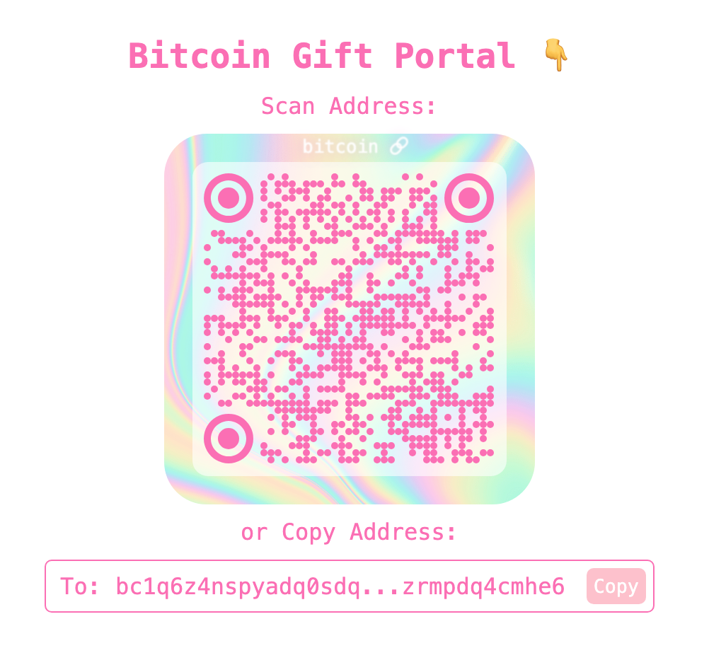

# 🕳 Portals - Your Bitcoin Gift Portal!

Welcome to **Portals**, a simple and fun way to embed a Bitcoin address on your website or blog. Whether you want people to scan a QR code or copy/paste your Bitcoin address, this project makes it *effortless*. Customize it, fork it, or embed it directly on your site—it's all up to you!

---

## 🌀 What is a Portal?

A **Portal** is like a magical 🕳 where people can send Bitcoin gifts! With a sleek QR code and easy "Copy Address" button, it’s perfect for static embeds on blogs, personal websites, or any creative project.

<p align="center">
  
</p>

👉 **[See it live here! 👀](https://mullojo.github.io/portals/basic/)**

Check it out to experience the magic in action! Customize it to make your own 🌀 Portal for sharing your Bitcoin address.


---

## 🛠 Features

- **Customizable**: Replace the Bitcoin address in the `basic` directory with your own.
- **Embed-Ready**: Use an `<iframe>` to embed the portal seamlessly on any website.
- **Lean & Simple**: Lightweight and efficient for fast loading.
- **Clipboard Support**: One-click "Copy Address" functionality (with permissions).

---

## 🎉 How to Use It

Follow these simple steps to create your own Portal:

### 1️⃣ Fork this Repo
Click the **Fork** button at the top right of this page to get started. Now you have your own copy of the repo to work with.

### 2️⃣ Edit Your Address
- Go to the `basic` directory.
- Open the `scripts.js` file.
- Replace the default Bitcoin address with your own in this line:

  ```javascript
  let address = "bc1q6z4nspyadq0sdq3vkcdtxxzwlywfva557wfqsm0h5g5xnnzrmpdq4cmhe6";
  ```

### 3️⃣ Push Changes
Once you've updated the address, commit and push your changes to your GitHub repo.

### 4️⃣ Embed the Portal
Copy and paste the following code into your blog or website:

```html
<iframe src="https://YOUR-GITHUB-USERNAME.github.io/portals/basic/" 
        width="100%" 
        height="500" 
        allow="clipboard-write"> 
</iframe>
```

Be sure to replace `YOUR-GITHUB-USERNAME` with your actual GitHub username.

---

## 🌟 Example Embed

Here’s how your Portal might look:

```html
<iframe src="https://mullojo.github.io/portals/basic/" 
        width="100%" 
        height="500" 
        allow="clipboard-write"> 
</iframe>
```

Feel free to test it out and see the magic in action! 🕳✨

---

## 🎨 Customization Ideas

- Change the QR code color or style in `scripts.js`.
- Replace the background image in the `styles.css` file.
- Add more functionality, like Lightning Network invoices or donation messages!

---

## 💬 Feedback and Contributions

We’d love to hear how you’re using **Portals**! Share your ideas, improvements, or customizations by creating a pull request or opening an issue.

Let’s make Bitcoin gifting fun and creative for everyone! 🕳🎁

---

## 📜 License

This project is open-source under the MIT License. Use it freely and responsibly.

---

Ready to jump in? 🕳 Start forking, customizing, and sharing your own **Portal** today!